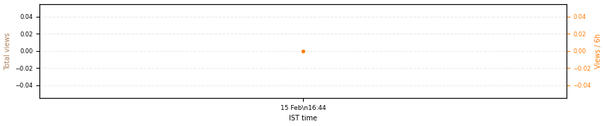
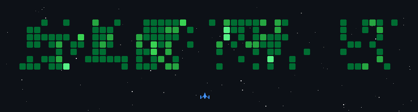

<p align="center">
  
</p>
<p align="center">
  
</p>

Heya ! Feel free to scramble through my profile, or maybe try entering ``` npx ayushdhiman ``` in your terminal to know me and send me a message and play some games, or let me give you a tour myself hehehe. 😉

Let’s start with a small introduction. I'm **Ayush Dhiman** (ah-yush dhee-maan, {ɑːˈjuːʃ dʰiːˈmɑːn}), 23 years old, and currently building [PlainCrisp](https://www.plaincrisp.com). I love **Formula 1**, **hackathons**, tasty food, and staying updated on the latest tech news, along with some vibe coding sessions.

Graduated with a **Bachelor of Technology in Computer Science**, specializing in Cyber Security and Digital Forensics from VIT Bhopal University. I am **currently looking for new opportunities** and am open to offers!

As a fresher, I'm exploring different areas with knowledge of a little bit of everything. This includes building **Full Stack Applications**, integrating **Gen-AI** into workflows and fine-tuning models, developing **Mobile Apps** with Flutter, and creating **Backends** using FastAPI & NodeJS. I also have 5+ years of hands-on **Cyber Security** knowledge and familiarity with **DevOps & Cloud** stuff like containerization (Docker), APIs, CI/CD (Jenkins), and cloud platforms.

Most importantly, I genuinely want to work hard and provide value to projects that people actually need.

Don’t just take my word for it – check out some of my projects (demos included!):

### 🌟📰 **PlainCrisp** *[Link](https://www.plaincrisp.com)* - Soft launch expected by late february: 
Are you frustrated from clickbait-y, novel sized, un-personalized, boring news articles?  PlainCrisp caresses your mind and patience, with clarity in a single sentence.


### 🎨💼 **Portfolio** *[Link](https://ayushdhiman.dev)*: 
Built from scratch a portfolio website, with case studies on my major projects and subtle animations throughout the website focusing on minimalism and playfulness.


### 🤖📚 **RAGging** *[Link](https://github.com/AyushDhimann/RAGging)*: 
RAG with 11 agents and a local open-source LLM supporting 5 languages with a 100% document retrieval accuracy under 1 seconds using gemma3:4b and Gemini embeddings along with BM25 ranker.


### 🍜🔍 **Noodl.** *[Link](https://github.com/AyushDhimann/Noodl)*:
A Web3 app that turns topics into gamified courses named as Noodl.


### 🧠🔍 **Boring Brains** *[Link](https://github.com/AyushDhimann/BoringBrains)*:
A Chrome extension that records your browsing history (opt-in) to help you search for anything, big or small. Use cases include shopping, studying, research, etc. **Won the Student Hacks hackathon.**


### 🚗💨 **Ghummi Ghummi** *[Link](https://github.com/AyushDhimann/Ghummi-Ghummi)*:
An open-world car driving game built for browsers, initially inspired by Slowroads.io.


### 🎶💡 **Asus TUF RGB Music** *[Link](https://github.com/AyushDhimann/Asus-tuf-rgb-music)*:
An improved fork of G-Helper enabling RGB keyboard lighting on Asus TUF Windows laptops to react to music based on decibel levels.


### 🤖🦖 **AXIOM** *[Link](https://github.com/AyushDhimann/AXIOM)*:
An AI-powered interview preparation platform featuring MCQ test simulations, camera-based live interviews, global leaderboards, and a virtual hangout space where users become dinosaurs!


### 📊🐍 **TabViz** *[Link](https://github.com/AyushDhimann/TabViz)*:
A Python PIP library to visualize datasets in Google Colab using AI powered by Tableau, requiring just three commands. **Won the Tableau 2023-24 Hackathon.**


### ✍️📱 **Signify** *[Link](https://github.com/AyushDhimann/Signify)*:
A Dropbox-powered, AI-based document signing mobile application built using Flutter.


### 🎣🛡️ **Phish Warden** *[Link](https://github.com/PhishWarden)*:
A machine learning-based phishing detection browser extension, paired with a mobile app for detecting phishing links in text messages. **Grand Finalist for the National Kavach Hackathon 2023.**


### 📈🌐 **Traffic Forecast** *[Link](https://github.com/AyushDhimann/Traffic-Forecast)*:
A WordPress plugin designed to track user behavior on a website, featuring a Tableau-powered dashboard for data visualization directly within WordPress. **Winner of the Tableau 2023 Hackathon.**


#### Also do feel free to reach me out!

* **Email:** [contactayushdhiman@gmail.com](mailto:contactayushdhiman@gmail.com)
* **LinkedIn:** [linkedin.com/ayushdhimann](https://www.linkedin.com/in/ayushdhimann/)

---


